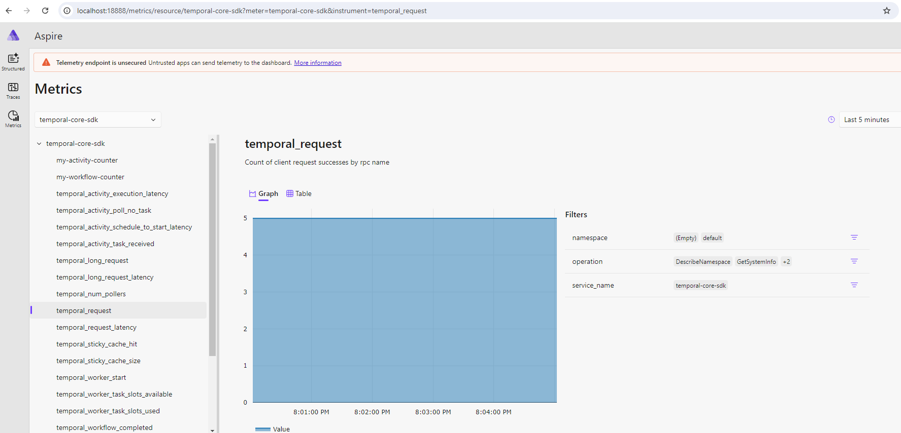

# OpenTelemetry - .Core SDK Forwarding

This sample shows how to configure the SDK to forward metrics from the Core SDK.

The main advantage over using .NET metrics is simplicity.

This sample also shows how to configure custom metrics from both an activity and a workflow in a replay-safe manner.

To run, first see [README.md](../../../README.md) for prerequisites.

Then, run the following from [one directory up ](../docker-compose.yaml) to start the .NET Aspire Dashboard which will collect telemetry. The dashboard UI is available at http://localhost:18888.

    docker compose up

Then, run the following from this directory in a separate terminal to start the worker:

    dotnet run worker

Then in another terminal, run the workflow from this directory:

    dotnet run workflow

The workflow will complete.

## Traces

Traces can be viewed at http://localhost:18888/traces.

You can select either `worker` or `workflow` for traces; both should show the same trace. The workflow should appear and when clicked, may look something like:

## Metrics

Metrics can be viewed by clicking the metrics tab on the dashboard.

Select `temporal-core-sdk`.

All metrics emitted by the Core SDK will be shown. It may look something like:

